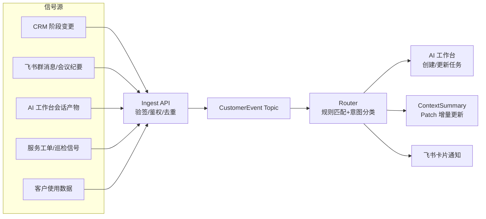
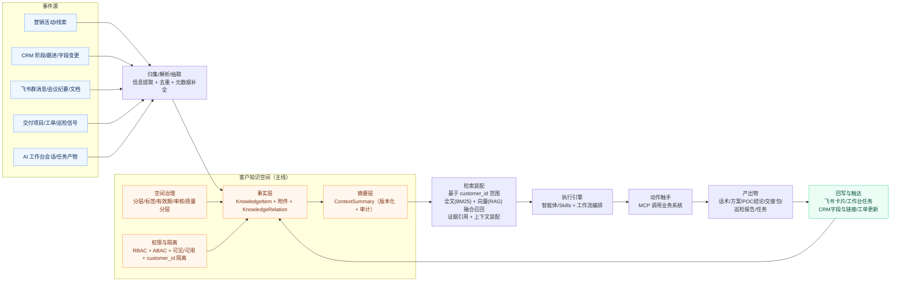
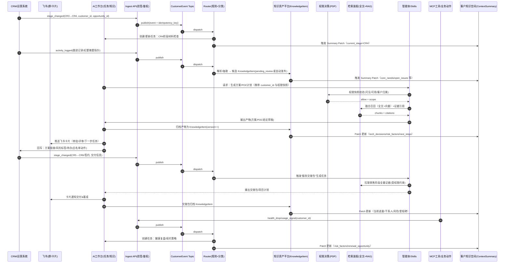

# AI 工作台产品架构梳理：端到端价值链整合

**文档版本**：V2.0
**创建日期**：2026年04月21日
**文档状态**：草案
**适用范围**：产品、研发、业务、解决方案、交付、客户成功

### 版本修订记录

| 版本 | 日期 | 修订内容 |
|------|------|---------|
| V1.0 | 2026-04-21 | 初稿：将"公司 AI 化营销&服务一条链"两张核心架构图独立沉淀 |
| V2.0 | 2026-04-21 | 重大重构：以端到端价值链为主轴，整合营销链+服务链+跨链衔接+客户知识空间为统一视图 |
| V2.1 | 2026-04-21 | 阶段调整：营销阶段从 CR2-CR6（含CR4b）扩展为 CR1-CR7；新增 CR1 用户名单、CR7 交叉销售；原 CR4+CR4b 合并为 CR4 KA攻坚 |

---

## 一、文档目的

AI 工作台作为公司 AI 化的"重任务入口"，需要把营销、销售、交付与客户成功串成**同一条闭环链路**来展示，而不是按业务条线分割能力。

v1.0 沉淀了两张技术架构图（价值流 + 时序图），但缺少**业务视角的价值链主线**——即客户从线索到续约/扩容的全旅程中，AI 在每个环节做了什么、衔接点如何流转、闭环如何形成。

本文以**端到端价值链**为主轴重构，实现：

1. **一条链看清全貌**：从 CR1 到 CR7 的客户旅程中，每个阶段的业务动作、AI 赋能、衔接信号一目了然
2. **跨链衔接显性化**：营销→服务、服务→营销的交接点和信号回传不再是隐含的，而是链路上的显式节点
3. **客户知识空间作为中枢**：所有阶段共享同一客户记忆，知识随链路流转而增量更新
4. **四层架构落地到链路**：技术架构不是悬浮的，每个能力都能追溯到它支撑的链路环节

---

## 二、端到端价值链总览

> 这张图是本文的核心——把**营销—销售—交付—客成**串成一个闭环，每个节点展开三层（业务动作 / AI 赋能 / 衔接信号），并标注客户知识空间在每个阶段的知识增量。

```
┌─────────────────────────────────────────────────────────────────────────────────┐
│                          端到端价值链 · 主轴视图                                  │
│                                                                                 │
│   营销链                                        交接点       服务链             │
│ ┌──────┬──────┬──────┬──────────────┐          ┌──────┬──────┬──────┐           │
│ │ CR1  │ CR2  │ CR3  │     CR4      │          │ CR5  │ CR6  │ CR7  │           │
│ │用户名单│验证意向│行业方案│  KA攻坚     │ ──────→│签约交付│持续价值│交叉销售│           │
│ └──┬───┴──┬───┴──┬───┴──────┬──────┘          └──┬───┴──┬───┴──┬───┘           │
│    │      │      │          │                    │      │      │               │
│    ▼      ▼      ▼          ▼                    ▼      ▼      ▼               │
│ ┌───────────────────────────────────────────────────────────────────┐           │
│ │               客户知识空间 · ContextSummary（中枢）                 │           │
│ │  V1{名单+来源} → V5{+画像+评分} → V12{+痛点+竞品} → V23{+方案+POC} │           │
│ │  → V31{+合同} → V45{+进展+满意度} → V67{+健康度} → V80{+扩容信号}  │           │
│ └──────────────────────────────┬────────────────────────────────────┘           │
│                                │                                                │
│            ┌───────────────────┘                                                │
│            ▼                                                                    │
│   扩容/转介绍信号回流 ────────────────────→ CR1 新名单识别                        │
│                                                                                 │
└─────────────────────────────────────────────────────────────────────────────────┘
```

### 2.1 链路阶段定义

| 阶段 | 含义 | 价值链角色 | 驱动智能体 | 核心业务目标 |
|------|------|-----------|-----------|-------------|
| CR1 | 用户名单 | 营销链·源头 | 获客分析师 | 名单获取与线索初筛 |
| CR2 | 验证意向 | 营销链·入口 | 获客分析师 | 高质量线索识别与触达 |
| CR3 | 行业方案 | 营销链·匹配 | 方案&POC 助手 | 行业方案精准匹配 |
| CR4 | KA攻坚 | 营销链·定制+验证 | 方案&POC 助手 | 客户方案定制 + POC 验证 + 商务谈判 |
| CR5 | 签约交付 | **交接点** | 交付规划助手 | 销售→服务无缝交接 |
| CR6 | 持续价值 | 服务链·持续 | 客户成功助手 | 客户留存与持续价值交付 |
| CR7 | 交叉销售 | 服务链·扩展 | 客户成功助手 | 增购、转介绍与价值扩展 |

### 2.2 两个关键衔接

**衔接 A：营销→服务（CR4→CR5）**

签约是营销链到服务链的硬交接点。AI 在此自动生成**服务交接包**，从 ContextSummary 抽取销售阶段全部关键信息，交付团队无需从零了解客户。

**衔接 B：服务→营销（CR7→CR1）**

客户运营中产生的扩容信号、转介绍机会，自动识别为交叉销售新线索，回传营销侧形成闭环。

---

## 三、营销链 AI 赋能详解（CR1 - CR4）

> 营销链覆盖客户从"陌生人"到"签约"的全过程。AI 的核心价值：**缩短每个阶段的停留时间、提高阶段间转化率、规模化复制销冠经验**。

### 3.1 CR1 用户名单 · 获客分析师

#### 业务动作

| 动作 | 现状痛点 | AI 赋能后 |
|------|---------|----------|
| 名单获取 | 人工收集，来源分散 | AI 自动聚合多渠道线索（冷呼/活动/网站/转介绍），统一入库 |
| 名单初筛 | 电销逐条拨打，效率低 | AI 批量初筛+优先级排序，无效线索过滤时间从天级降到分钟级 |
| 线索去重 | 跨渠道重复录入 | AI 自动识别重复线索并合并，保持客户唯一视图 |
| 来源标注 | 渠道来源不明 | AI 自动标注来源渠道与获取时间，支撑后续溯源分析 |

#### AI 赋能构成

```
输入：原始名单 + 来源渠道（冷呼/活动/网站/转介绍）
      │
      ▼
┌─ 知识调用 ──────────────────────────────┐
│  通用层：线索评分模型 + 去重规则             │
│  客户层：CRM 历史数据（已有客户排除）        │
└────────────────────────────────────────┘
      │
      ▼
输出：去重后名单 + 初筛评分
     来源渠道标注
     优先级建议（高/中/低）
     去重合并报告
```

#### 衔接信号 → CR2

| 触发条件 | 信号内容 | 下游动作 |
|---------|---------|---------|
| 初筛通过 + 名单入库 | `lead_imported(customer_id, source, preliminary_score)` | 进入验证意向阶段，分配电销/销售跟进 |

#### 知识空间增量

```
CR1 完成 → ContextSummary V1:
  {来源渠道, 获取时间, 初筛评分, 基础联系信息}
```

---

### 3.2 CR2 验证意向 · 获客分析师

#### 业务动作

| 动作 | 现状痛点 | AI 赋能后 |
|------|---------|----------|
| 线索筛选 | 人工逐条查看，效率低 | AI 批量评分+优先级排序，筛选时间从天级降到分钟级 |
| 客户画像 | 依赖销售个人经验 | AI 自动生成企业画像（规模/行业/痛点/决策人） |
| 触达策略 | 千篇一律的推销话术 | AI 基于线索特征推荐最佳触达方式和个性化话术 |
| 竞品判断 | 缺乏竞品情报 | AI 分析竞品使用情况，给出差异化建议 |
| KA/中小分流 | 人工判定不精准 | AI 自动判定客户类型，匹配不同跟进策略 |

#### AI 赋能构成

```
输入：企业名称 + 行业 + 来源渠道（可选：网站 URL）
      │
      ▼
┌─ 知识调用 ──────────────────────────────┐
│  通用层：销售方法论 + 产品能力全集           │
│  行业层：行业知识库 + 竞品知识库              │
│  客户层：CRM 历史数据 + 公开信息             │
└────────────────────────────────────────┘
      │
      ▼
输出：综合评分(0-100) + 评分依据
     企业概要画像(100字)
     关键决策人推测
     推荐接触切入点
     匹配解决方案模板
     建议优先级（高/中/低）
```

#### 衔接信号 → CR3

| 触发条件 | 信号内容 | 下游动作 |
|---------|---------|---------|
| 线索评分 > 80 且首次沟通完成 | `lead_qualified(customer_id, score, profile)` | 自动创建方案助手任务，分配给对应销售 |

#### 知识空间增量

```
CR2 完成 → ContextSummary V5:
  {基础画像, 来源渠道, 评分, 初步需求方向, 竞品信息}
```

---

### 3.3 CR3 行业方案 · 方案&POC 助手

#### 业务动作

| 动作 | 现状痛点 | AI 赋能后 |
|------|---------|----------|
| 行业匹配 | 销售不熟悉所有行业 | AI 根据客户行业/规模自动匹配最佳解决方案模板 |
| 方案生成 | 从零写方案，耗时长 | AI 在模板基础上生成行业定制方案，时间从天级降到小时级 |
| 竞品对比 | 手工整理对比表 | AI 自动生成竞品功能对比表，突出差异化优势 |
| 案例引用 | 找不到合适案例 | AI 检索同行业/相似规模成功案例并引用 |

#### AI 赋能构成

```
输入：客户行业 + 规模 + 初步需求（来自 ContextSummary V1）
      │
      ▼
┌─ 知识调用（运行时知识组装） ─────────────┐
│  客户层：ContextSummary（客户专属层）        │
│  行业层：行业知识库 → 解决方案模板           │
│  行业层：成功案例库 → 相似案例               │
│  行业层：竞品知识库 → 对比信息               │
│  通用层：产品能力全集 → 产品功能             │
└────────────────────────────────────────┘
      │
      ▼
输出：行业匹配方案（可编辑/导出 PPT/Word）
     竞品对比表
     推荐案例列表
      │
      ▼
  自动存入客户知识空间（历史方案）
  脱敏后可选沉淀到行业知识层（案例积累）
```

#### 衔接信号 → CR4

| 触发条件 | 信号内容 | 下游动作 |
|---------|---------|---------|
| 客户确认需求方向 + 方案初版通过 | `requirement_confirmed(customer_id, requirements)` | 升级为客户定制化方案阶段，需求分析启动 |

#### 知识空间增量

```
CR3 完成 → ContextSummary V12:
  {+首次沟通要点, +决策人确认, +核心痛点, +竞品情况, +行业方案版本}
```

---

### 3.4 CR4 KA攻坚 · 方案&POC 助手

> CR4 是营销链的核心攻坚阶段，覆盖客户方案定制、POC 验证与商务谈判全流程。KA 客户在此阶段需要方案、售前、PM、管理者多方协同。

#### 业务动作

| 动作 | 现状痛点 | AI 赋能后 |
|------|---------|----------|
| 需求分析 | 客户需求表述模糊 | AI 从沟通记录中提取结构化需求 |
| 定制方案 | 通用模板不贴合 | AI 基于客户具体需求在模板上深度定制 |
| 报价建议 | 定价缺乏依据 | AI 基于客户规模和方案复杂度给出报价参考区间 |
| 内部对齐 | 售前+销售信息不同步 | AI 工作台统一协作空间，知识实时共享 |
| POC 方案设计 | 范围常被客户无限扩大 | AI 设计 POC 边界、评估标准、时间计划 |
| 技术验证 | 依赖技术人员现场 | AI 辅助技术验证，提供验证脚本/检查清单 |
| 案例引用 | 缺少同场景案例支撑 | AI 检索相似场景成功案例增强说服力 |
| POC 总结 | 结论不结构化 | AI 自动生成 POC 结论报告 |
| 商务谈判 | 缺乏谈判策略支撑 | AI 基于客户画像与竞品态势提供谈判要点与话术 |

#### AI 赋能构成

```
输入：客户具体需求 + 沟通记录（来自 ContextSummary V12）
      │
      ▼
┌─ 知识调用 ──────────────────────────────┐
│  客户层：ContextSummary + 历史沟通记录       │
│  行业层：同行业定制案例 + 行业最佳实践        │
│  行业层：竞品知识库 → 对比信息 + 谈判要点     │
│  通用层：产品定价模型 + 配置规则 + POC SOP    │
└────────────────────────────────────────┘
      │
      ▼
输出：客户定制化方案
     报价建议（含参考区间与依据）
     风险提示（需求与产品能力 Gap）
     POC 方案（含范围/评估标准/时间线）
     技术验证辅助
     POC 结论报告
     商务谈判要点与话术
```

#### 衔接信号 → CR5（**营销→服务关键交接**）

| 触发条件 | 信号内容 | 下游动作 |
|---------|---------|---------|
| POC 评估通过 + 客户发送意向 | `deal_won(customer_id, contract_terms, handoff_info)` | **激活交付规划助手预启动**，提前准备团队资源；生成服务交接包 |

#### 知识空间增量

```
CR4 完成 → ContextSummary V23:
  {+深度需求分析, +定制方案版本, +报价记录, +客户反馈, +决策链,
   +POC结论, +技术顾虑与解答, +价格敏感点, +内部支持者, +合同关键条款预览}
```

---

## 四、交接点：营销→服务（CR4→CR5 签约交付）

> CR5 是整条价值链的**硬交接点**——销售团队的工作成果需要无损传递给交付团队。AI 的核心价值：**消除信息断层、自动生成交接包、预启动交付准备**。

### 4.1 交接包自动生成

传统模式下，销售与交付之间存在严重信息断层：交付团队需要重新了解客户背景、需求细节、承诺内容。AI 通过 ContextSummary 自动生成服务交接包：

```
ContextSummary V23（销售阶段终态）
      │
      ▼ AI 自动抽取与结构化
┌─ 服务交接包 ─────────────────────────────┐
│                                          │
│  1. 客户概要：企业画像 + 决策链 + 关键联系人   │
│  2. 需求摘要：核心需求 + 优先级 + 隐含需求     │
│  3. 方案快照：签约方案版本 + 定制内容          │
│  4. 承诺清单：销售过程中的所有承诺             │
│  5. 风险提示：技术顾虑 + 价格敏感点 + 内部阻力  │
│  6. 交付约定：合同中的交付条款 + 特殊要求       │
│  7. 历史互动：关键沟通节点摘要                 │
│                                          │
└──────────────────────────────────────────┘
      │
      ▼
  交付团队收到飞书卡片通知 + AI 工作台任务
  ContextSummary 同步 Patch → V31
```

### 4.2 交付规划助手

| 功能 | 说明 |
|------|------|
| 交付计划生成 | 根据合同内容和交接包生成标准化交付计划 |
| 风险识别 | 基于历史项目数据识别当前项目的风险点 |
| 里程碑管理 | 跟踪关键里程碑，AI 预警滞后风险 |
| 资源调配建议 | 建议所需人员技能组合与可用资源 |
| 交付进度追踪 | 自动从项目工单/飞书群提取进度，更新 ContextSummary |

### 4.3 衔接信号 → CR6

| 触发条件 | 信号内容 | 下游动作 |
|---------|---------|---------|
| 项目上线验收完成 | `project_live(customer_id, go_live_date, satisfaction)` | 建立健康度监控，激活客户成功助手 |

### 4.4 知识空间增量

```
CR5 完成 → ContextSummary V45:
  {+合同关键条款, +交付约定, +特殊要求, +项目进展, +满意度反馈, +扩展需求苗头}
```

---

## 五、服务链 AI 赋能详解（CR6 持续价值 + CR7 交叉销售）

> 服务链覆盖客户从"上线"到"续约/扩容/转介绍"的持续运营阶段。AI 的核心价值：**提前识别风险、发现扩容机会、提升服务效率**。

### 5.1 CR6 持续价值 · 客户成功助手

#### 业务动作

| 动作 | 现状痛点 | AI 赋能后 |
|------|---------|----------|
| 健康度监控 | 被动等客户投诉 | AI 综合使用率/满意度/支付行为多维评分，每周自动计算 |
| 流失预警 | 发现时已来不及 | AI 提前 90/60/30 天识别高风险客户并预警 |
| 续约推进 | 续约谈判缺乏策略 | AI 提供续约谈判建议和个性化话术 |
| 日常服务 | 重复问题人工处理 | AI 自动应答+工单智能分派 |
| 运维/数据运营 | 人工巡检效率低 | AI 自动巡检+数据运营报告生成 |
| 季度复盘 | 复盘材料手工整理 | AI 自动生成季度价值复盘报告 |

#### AI 赋能构成

```
输入：客户使用数据 + 服务工单 + 满意度调查（持续流入）
      │
      ▼
┌─ 知识调用 ──────────────────────────────┐
│  客户层：ContextSummary（完整客户记忆）       │
│  行业层：同行业客户最佳实践 + 常见问题        │
│  通用层：服务 SOP + 产品功能 + 升级路径       │
└────────────────────────────────────────┘
      │
      ▼
输出：健康度评分(红/黄/绿) + 风险因素
     续约策略建议 + 话术
     流失预警（90/60/30天）
     季度价值复盘报告
```

#### 衔接信号 → CR7

| 触发条件 | 信号内容 | 下游动作 |
|---------|---------|---------|
| 满意度高 + 使用深度扩展 | `upsell_signal(customer_id, product_area, confidence)` | 进入交叉销售阶段，评估增购/转介绍机会 |
| 客户投诉升级 | `escalation(customer_id, severity, issue)` | 自动提醒客户负责人，生成安抚/挽回建议 |
| 合同即将到期 | `contract_expiring(customer_id, days_left)` | 提升服务优先级，生成续约服务方案 |
| 新签客户上线 | `onboarded(customer_id, products)` | 自动创建服务档案，生成 Onboarding 计划 |

#### 知识空间增量

```
CR6 持续更新 → ContextSummary V67:
  {+使用健康度, +续约意向, +服务记录, +满意度趋势, +流失风险等级}
```

---

### 5.2 CR7 交叉销售 · 客户成功助手

> CR7 是服务链的扩展阶段，基于现有客户关系挖掘增购、转介绍机会，驱动价值链闭环回流到营销侧。

#### 业务动作

| 动作 | 现状痛点 | AI 赋能后 |
|------|---------|----------|
| 增购识别 | 错过交叉销售窗口 | AI 基于使用深度与功能咨询识别增购机会 |
| 转介绍挖掘 | 依赖客户主动推荐 | AI 识别高满意度客户并推荐转介绍时机与话术 |
| 扩容方案 | 从零设计扩容方案 | AI 基于现有使用数据自动生成扩容方案与报价 |
| 交叉销售线索 | 增购线索断裂 | AI 自动生成交叉销售线索并回流至 CR1/CR2 |

#### AI 赋能构成

```
输入：CR6 健康度数据 + 使用深度 + 功能咨询记录（来自 ContextSummary V67）
      │
      ▼
┌─ 知识调用 ──────────────────────────────┐
│  客户层：ContextSummary（完整客户记忆）       │
│  行业层：同行业客户扩容案例 + 升级路径        │
│  通用层：产品矩阵 + 定价模型 + 转介绍 SOP     │
└────────────────────────────────────────┘
      │
      ▼
输出：增购机会推荐 + 置信度
     转介绍时机建议 + 话术
     扩容方案 + 报价
     交叉销售线索（回流 CR1/CR2）
```

#### 衔接信号 → CR1/CR2（**服务→营销关键回流**）

| 触发条件 | 信号内容 | 下游动作 |
|---------|---------|---------|
| 增购需求确认 | `cross_sell_lead(customer_id, product_area, confidence)` | 回流至 CR1/CR2，创建新线索或新机会 |
| 转介绍成功 | `referral_made(customer_id, referral_contact)` | 新客户线索入库 CR1 |
| 扩容方案通过 | `expansion_confirmed(customer_id, scope)` | 进入 CR3 行业方案匹配 |

#### 知识空间增量

```
CR7 更新 → ContextSummary V80+:
  {+扩容信号, +转介绍记录, +增购历史, +交叉销售线索状态}
```

---

## 六、跨链信号与闭环机制

> 信号是驱动链路流转的"血液"。本节将所有跨阶段、跨链信号统一梳理，明确触发条件、流向、AI 动作。

### 6.1 顺链信号（营销链内部 + 营销→服务）

```
CR1 ──lead_imported──→ CR2 ──lead_qualified──→ CR3 ──requirement_confirmed──→ CR4
                                                                        │
                                                                  deal_won
                                                                        │
                                                                        ▼
                                                                  CR5（交接包自动生成）
                                                                        │
                                                                  project_live
                                                                        │
                                                                        ▼
                                                                  CR6 ──upsell_signal──→ CR7
```

| 信号 | 来源 | 流向 | 触发条件 | AI 自动动作 |
|------|------|------|---------|------------|
| `lead_imported` | CR1 | → CR2 | 初筛通过 + 名单入库 | 分配电销/销售跟进 |
| `lead_qualified` | CR2 | → CR3 | 评分>80 + 首次沟通完成 | 创建方案助手任务，分配销售 |
| `requirement_confirmed` | CR3 | → CR4 | 需求方向确认 + 行业方案通过 | 升级为 KA 攻坚阶段 |
| `deal_won` | CR4 | → CR5 | POC 通过 + 客户意向确认 | 激活交付助手预启动 + 生成交接包 |
| `project_live` | CR5 | → CR6 | 验收完成 | 激活客成助手 + 建立健康度监控 |
| `upsell_signal` | CR6 | → CR7 | 满意度高 + 使用深度扩展 | 进入交叉销售阶段 |

### 6.2 逆链信号（服务→营销）

> 这是价值链闭环的关键——服务侧产生的信号回流到营销侧，开启新一轮价值创造。

```
CR7 ──cross_sell_lead──→ CR1/CR2（增购/转介绍新线索）
CR7 ──referral_made──→ CR1（转介绍新客户入库）
CR6 ──escalation──→ CR4/CR5（投诉升级通知负责人）
CR6 ──contract_expiring──→ CR3（续约方案生成）
```

| 信号 | 来源 | 流向 | 触发条件 | AI 自动动作 |
|------|------|------|---------|------------|
| `cross_sell_lead` | CR7 | → CR1/CR2 | 增购需求确认 | 回流至 CR1/CR2 创建新线索 |
| `referral_made` | CR7 | → CR1 | 转介绍成功 | 新客户线索入库 CR1 |
| `expansion_confirmed` | CR7 | → CR3 | 扩容方案通过 | 进入 CR3 行业方案匹配 |
| `escalation` | CR6 | → CR4/CR5 | 客户投诉升级 | 提醒负责人 + 生成挽回建议 |
| `contract_expiring` | CR6 | → CR3 | 合同到期前 90 天 | 生成续约方案 + 提升服务优先级 |
| `onboarded` | CR5 | → CR6 | 新签客户上线 | 创建服务档案 + Onboarding 计划 |

### 6.3 信号路由架构



---

## 七、客户知识空间：链路中枢

> 客户知识空间是整条价值链的"记忆系统"——所有阶段的智能体共享同一客户的 ContextSummary，确保跨阶段上下文连续不断层。

### 7.1 时间轴演进

```
t0 CR1 名单阶段    → V1:  {来源渠道, 获取时间, 初筛评分, 基础联系信息}
t1 CR2 验证阶段    → V5:  {+基础画像, +评分, +初步需求方向, +竞品信息}
t2 CR3 方案阶段    → V12: {+首次沟通要点, +决策人确认, +核心痛点, +竞品情况}
t3 CR4 攻坚阶段    → V23: {+深度需求, +定制方案, +POC结论, +价格敏感点, +决策链}
t4 CR5 交付阶段    → V45: {+合同关键条款, +交付约定, +特殊要求, +项目进展, +满意度反馈}
t5 CR6 运营阶段    → V67: {+使用健康度, +续约意向, +服务记录, +满意度趋势}
t6 CR7 交叉销售    → V80: {+扩容信号, +转介绍记录, +增购历史, +交叉销售线索状态}
```

### 7.2 知识空间三层架构

| 层级 | 内容 | 更新机制 | 访问权限 |
|------|------|---------|---------|
| **事实层** | KnowledgeItem + 附件 + KnowledgeRelation | 事件驱动，Ingest → 解析 → 抽取 → 去重 | 按 RBAC+ABAC 控制 |
| **摘要层** | ContextSummary（版本化 + 审计） | 信号触发 Patch 增量更新 / 定期 Full 重建 | 按客户归属隔离 |
| **治理层** | 分层/标签/有效期/审核/质量评分 | 人工审核 + 自动质量评估 | 管理员 + 知识运营 |

### 7.3 知识空间与链路节点的映射

| 链路节点 | 主要知识输入 | 主要知识产出 | Patch 字段 |
|---------|-------------|-------------|-----------|
| CR1 用户名单 | 多渠道线索 + CRM 去重 | 去重名单 + 初筛评分 | `lead_source`, `preliminary_score` |
| CR2 验证意向 | 行业知识库 + CRM 历史 | 企业画像 + 评分依据 | `basic_profile`, `score` |
| CR3 行业方案 | 行业方案模板 + 成功案例 | 行业方案 + 竞品对比 | `core_needs`, `competitors` |
| CR4 KA攻坚 | 客户沟通记录 + 定制案例 + POC 知识库 | 定制方案 + POC 结论 + 报价 | `deep_requirements`, `poc_conclusion`, `pricing_sensitivity` |
| CR5 交付 | 交接包 + 合同 | 交付计划 + 风险清单 | `contract_terms`, `delivery_plan` |
| CR6 持续价值 | 使用数据 + 服务记录 | 健康度 + 续约策略 | `health_score`, `renewal_opportunity` |
| CR7 交叉销售 | 扩容案例 + 产品矩阵 + 转介绍 SOP | 增购推荐 + 扩容方案 + 转介绍线索 | `cross_sell_lead`, `referral_record` |

---

## 八、四层架构与价值链映射

> 技术架构不是悬浮的——每一层都服务于价值链上的具体环节。本节将四层架构落地到链路节点，明确每个能力"支撑谁、用在哪"。

### 8.1 四层架构定义

```
┌─────────────────────────────────────────────────┐
│  L4 应用场景层  —  具体业务场景与用户体验           │
├─────────────────────────────────────────────────┤
│  L3 智能体层    —  阶段专属智能体 + 技能包           │
├─────────────────────────────────────────────────┤
│  L2 能力层      —  通用 AI 能力 + 知识引擎 + 数据引擎  │
├─────────────────────────────────────────────────┤
│  L1 基础层      —  大模型服务 + MCP + 安全合规        │
└─────────────────────────────────────────────────┘
```

### 8.2 映射矩阵

| 链路节点 | L4 应用场景 | L3 智能体 | L2 能力 | L1 基础 |
|---------|-----------|---------|--------|--------|
| CR1 用户名单 | 名单聚合面板、线索去重视图 | 获客分析师 + 电销技能包 | RAG 召回（CRM 去重）、文本生成 | 模型推理、MCP-CRM |
| CR2 验证意向 | 线索评分面板、批量线索处理 | 获客分析师 + 销售技能包 | RAG 召回（行业/竞品）、文本生成 | 模型推理、MCP-CRM |
| CR3 行业方案 | 方案生成工作台、竞品对比视图 | 方案助手 + 方案技能包 | RAG 召回（方案/案例）、文档生成 | 模型推理、MCP-CRM |
| CR4 KA攻坚 | 定制方案编辑器、报价辅助、POC 设计 | 方案助手 + 售前技能包 + 技术技能包 | RAG 召回（客户+行业+技术）、多轮对话、结构化输出 | 模型推理、MCP-CRM |
| CR5 交付 | 交接包视图、交付计划看板 | 交付规划助手 + 交付技能包 | RAG 召回（客户全量）、文档生成 | 模型推理、MCP-CRM/工单 |
| CR6 持续价值 | 健康度仪表盘、预警看板 | 客户成功助手 + 客成技能包 | 数据分析、异常检测、RAG 召回 | 模型推理、MCP-CRM/工单 |
| CR7 交叉销售 | 增购推荐面板、转介绍管理 | 客户成功助手 + 销售技能包 | 数据分析、RAG 召回（扩容案例） | 模型推理、MCP-CRM |

### 8.3 跨层能力共享

以下能力跨越多个链路节点，是"一次建设、全链复用"的核心资产：

| 共享能力 | 覆盖节点 | 实现层 |
|---------|---------|--------|
| 客户知识空间 | CR1-CR7 全链 | L2 能力层 |
| RAG 检索装配 | CR1-CR7 全链 | L2 能力层 |
| ContextSummary 版本管理 | CR1-CR7 全链 | L2 能力层 |
| 权限决策（PDP） | CR1-CR7 全链 | L1 基础层 |
| MCP 业务系统对接 | CR1-CR7 全链 | L1 基础层 |
| 飞书集成（卡片/消息） | CR1-CR7 全链 | L1 基础层 |

---

## 九、端到端价值流技术视图

> 以下两张图用于技术评审，展示系统在跑的具体链路。

### 9.1 端到端价值流（Value Stream）



### 9.2 典型机会时序图（Sequence）



---

## 十、完整协同流程示例：CR4 KA 客户方案推进

> 以 CR4 阶段一次 KA 客户方案推进为例，展示端到端价值链在实际业务中的运作。

```
1. 销售在飞书客户群提到"客户希望下周看方案"
   │
   ▼ AI 监听识别 → 信号触发
2. 飞书推送卡片给销售："检测到方案需求，是否启动方案生成？"
   │
   ▼ 销售点击"开始"
3. 跳转 AI 工作台 → 方案助手
   ├── 自动拉取：客户画像(CRM) + 历史沟通记录 + 行业方案模板(知识库)
   ├── AI 生成初版方案（RAG 召回 + LLM 整合）
   └── 销售在工作台编辑调整
   │
   ▼ 方案完成 → 进入 POC
4. 方案自动归档至客户知识空间 → ContextSummary Patch：
   {+定制方案版本, +客户反馈, +报价记录}
   │
   ▼ POC 阶段（同在 CR4 内）
5. AI 辅助设计 POC 方案（范围/评估标准/时间线）
   POC 结论报告自动生成 → ContextSummary Patch：
   {+POC结论, +技术顾虑, +价格敏感点}
   │
   ▼ 产出回写
6. CRM 回写方案链接 + 风险标签
   飞书卡片通知售前团队评审
   │
   ▼ 评审通过 → 衔接信号
7. 触发 deal_won 信号 → CR5 签约交付阶段启动
```

---

## 十一、落地路线图（价值链视角）

> 12 个月分三阶段，按价值链节点逐步打通。

### 阶段 1：基础（M1-M3）—— 打通客户知识空间 + CR4 单点突破

| 里程碑 | 交付物 | 价值链覆盖 |
|--------|--------|-----------|
| M1 | 知识空间基础（Ingest + KnowledgeItem + ContextSummary V1） | 全链基础设施 |
| M2 | AI 工作台 + 方案助手 MVP | CR3-CR4 |
| M3 | CRM 双向集成 + 信号路由 MVP | CR2→CR3→CR4 |

### 阶段 2：核心能力（M4-M6）—— 营销链全链 + 交接点

| 里程碑 | 交付物 | 价值链覆盖 |
|--------|--------|-----------|
| M4 | 名单获取 + 获客分析师 + 线索评分 | CR1→CR2→CR3 |
| M5 | 交付规划助手 + 服务交接包 | CR4→CR5 |
| M6 | 客户成功助手 + 健康度监控 | CR5→CR6 |

### 阶段 3：规模化（M7-M12）—— 全链闭环 + 智能化

| 里程碑 | 交付物 | 价值链覆盖 |
|--------|--------|-----------|
| M7 | 交叉销售 + 服务→营销逆链信号 | CR6→CR7→CR1 |
| M8 | CR1-CR7 完整信号链路打通 | 全链闭环 |
| M9-M10 | 技能市场 + 行业知识包 | 全链能力复用 |
| M11-M12 | 效果度量体系 + 持续优化 | 全链 ROI 可见 |

---

## 十二、这两张图在材料里的推荐用法

- **对内评审**：先放第 2 章（价值链总览）对齐业务边界，再放第 8 章（四层映射）对齐技术职责，最后放第 9 章（技术视图）对齐落地链路。
- **对外宣讲/路演**：只放第 2 章（价值链总览）+ 第 6 章（跨链信号闭环），四层映射和技术视图放备份页。
- **向上汇报**：第 2 章（总览）+ 第 11 章（路线图），强调"一条链闭环"和阶段性交付。
